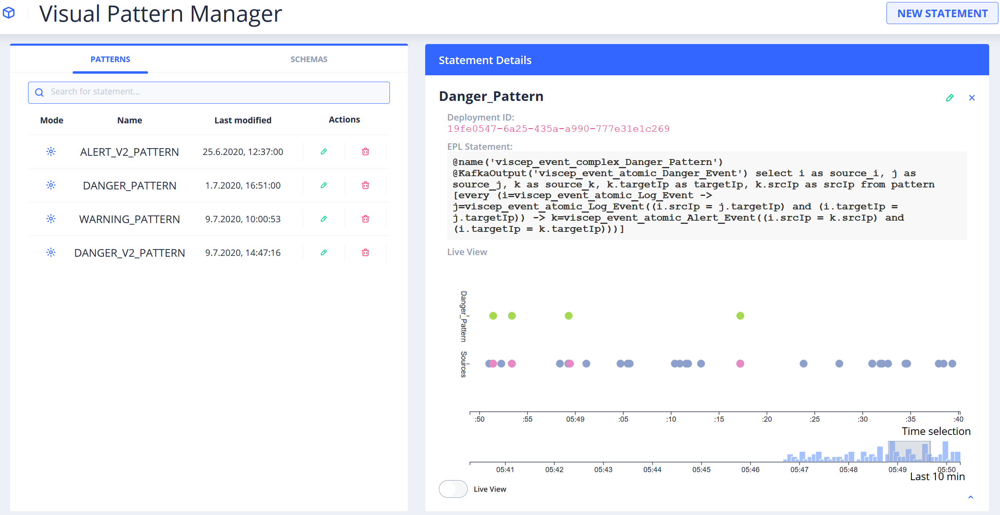
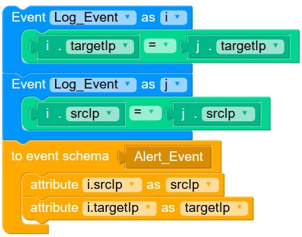
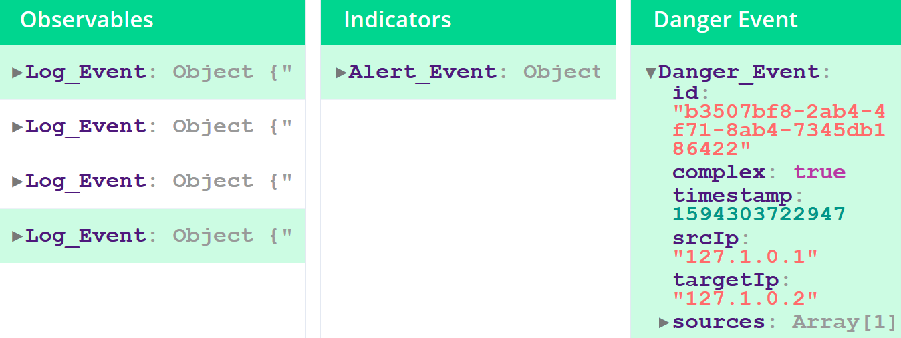

# Visual Pattern Manager

The **Visual Pattern Manager** is a Proof-of-concept work originating from research to integrate domain experts' knowledge into signature-based Security Analytics. 

The PoC uses [Google Blockly](https://developers.google.com/blockly/) with completely custom-built Blocks and Code Generators for the [Esper EPL](https://esper.espertech.com/release-8.5.0/reference-esper/html/preface.html). Thus, the PoC allows to build pattern and schemas to be used in a Esper Complex Event Processing environment. Additionally, existing patterns can be edited or deleted. A Debugger and a Live Event Chart allow for to analyse a pattern in-depth to identify possible misconfigurations. 

## Usage

### Visual pattern building
This component is used to create new statements or edit existing ones. The visual code editor [Google Blockly](https://developers.google.com/blockly/) is used for this purpose. The implemented blocks allow the construction of Esper EPL statements. The main parts of these statements are event patterns (blue blocks), conditions (green blocks), and actions (yellow blocks). The following figure shows a simple statement built with Blockly.

### Pattern debugging

Pattern debugging allows to test the created patterns by providing a detailed view on the data of the events and their relationships. The hierarchical order of complex events is represented within the pattern debugger. Therefore, this view displays three columns. The first column shows all observables, which are the source for any pattern related to the one to debug. The second column shows all indicators, which lead to this pattern and the third column shows the output (indicators or incidents) of the pattern itself.

## Development server

Run `ng serve` for a dev server. Navigate to `http://localhost:4200/`. The app will automatically reload if you change any of the source files.

## Installation

The Pattern Manager needs access to the [API Provider](https://github.com/Knowledge-based-Security-Analytics/backend-graphql). The respective connection strings `uri` and `websocketUri` within the `graphql.module.ts` file have to be adjusted accordingly for the project to run properyl.

Refer to [Pattern Matcher](https://github.com/Knowledge-based-Security-Analytics/Pattern-Matcher) for a guidline on how to set up the back end infrastructure.
